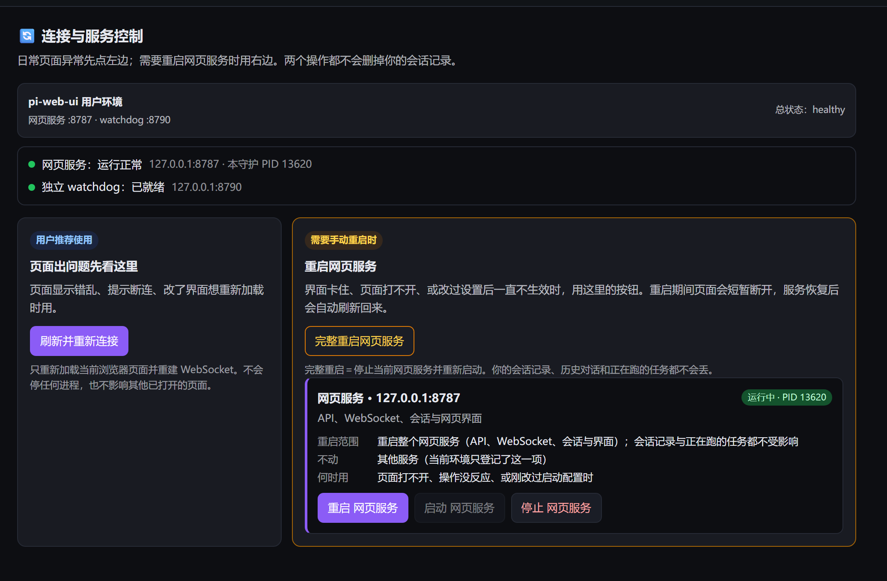
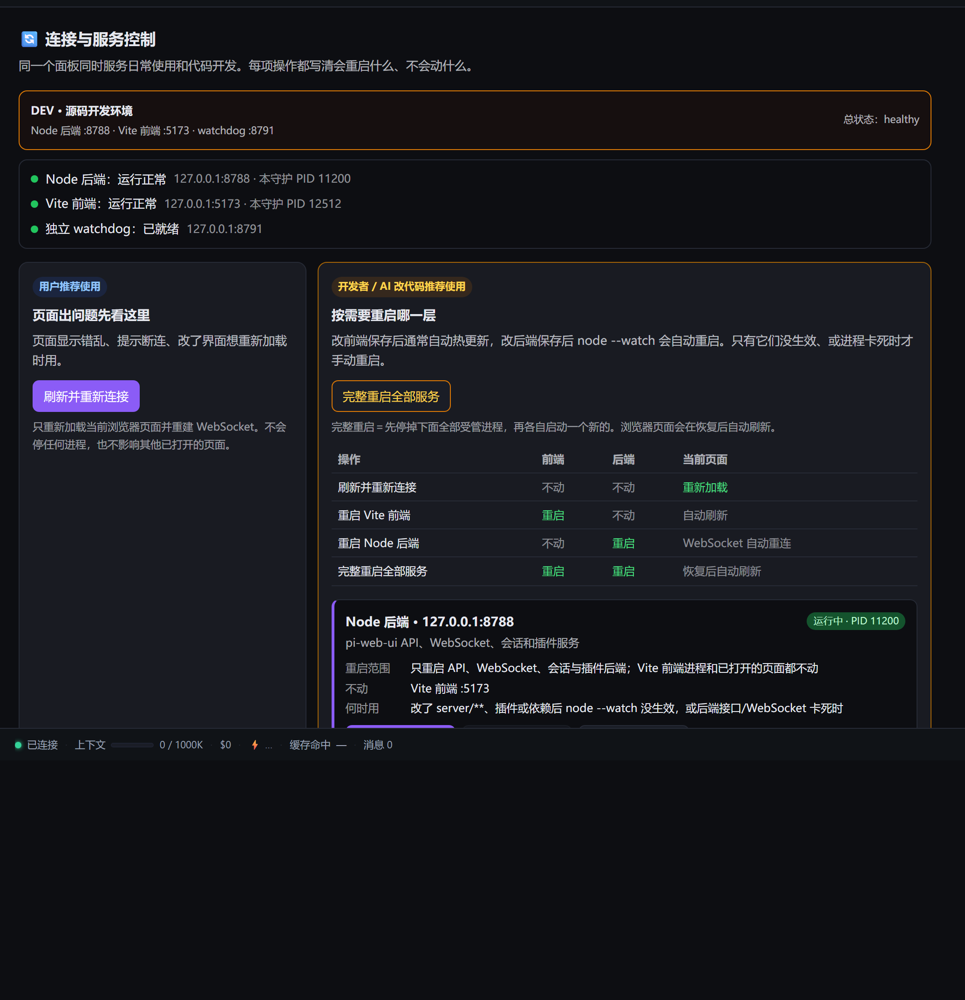

# pi-web-ui-contrib

对 [pi-web-ui](https://github.com/xing-shuyin/pi-web-ui) 的**对外贡献集合**：可直接安装的插件、版本绑定的补丁，以及提给上游的 issue / PR 草案。

> 本仓库原名 `pi-web-ui-reconnect-watchdog`。改名后旧的 git / 网页链接会被 GitHub 自动重定向，但插件目录也从 `reconnect-plugin/` 移到了 `plugins/reconnect/` —— **旧路径不会重定向**，上游默认插件列表里的条目需要同步更新（见 [`upstream/README.md`](upstream/README.md)）。

## 目录

| 路径 | 内容 |
| --- | --- |
| [`plugins/`](plugins/) | 可直接安装的界面插件，一个子目录一个插件（各自带 `manifest.json`） |
| [`patches/`](patches/) | 对 pi-web-ui / pi 编译产物的补丁（**与版本强绑定**，升级后需重跑） |
| [`upstream/`](upstream/) | 准备提给上游的 issue / PR 草案与状态 |
| [`catalog.json`](catalog.json) | 插件市场目录文档（供 pi-web-ui 一键同步安装） |
| [`examples/`](examples/) | 配置示例（restart descriptor） |
| [`scripts/`](scripts/) | 补丁脚本依赖的定位模块 |
| `screenshots/` | 界面截图 |

## 插件

### ⚡ 额度与成本 `codex-usage`

一次对话内按 **API 提供商 → 模型** 连续累计花费：换模型不清零、换提供商不串账；每个模型显示调用次数、输入/输出 token、平均每次成本与有效每百万 token 成本；订阅渠道标注「订阅（不计费）」，金额优先取响应自带的 `usage.cost`，缺失时按**已核实的官方牌价**回退。

```bash
pi-web-ui install xieweimo/pi-web-ui-contrib/plugins/codex-usage
```

细节见 [`plugins/codex-usage/README.md`](plugins/codex-usage/README.md)。

> 完整会话账本（跨重启/重开不归零）与多标签按页面隔离依赖宿主能力，见
> [`patches/patch-pi-web-ui-plugin-per-client-conversation.js`](patches/patch-pi-web-ui-plugin-per-client-conversation.js)；
> 未打补丁的宿主上会降级为「当前上下文回退」，不会崩。

### 🌐 代理健康 `proxy-health`

按可配置的 HTTPS 目标探测代理或直连网络；目标故障时再检查对照站点，不把网络问题武断归咎于代理节点。

```bash
pi-web-ui install xieweimo/pi-web-ui-contrib/plugins/proxy-health
```

适用范围、隐私边界及测试见 [`plugins/proxy-health/README.md`](plugins/proxy-health/README.md)。

### 🔄 重连 `reconnect`

一键「重新连接 / 重启服务」；配套独立守护进程，**服务卡死或崩溃时也能把它救回来**。

```bash
pi-web-ui install xieweimo/pi-web-ui-contrib/plugins/reconnect
```

细节见 [`plugins/reconnect/README.md`](plugins/reconnect/README.md)。

#### 为什么需要一个外部 watchdog

插件跑在 pi-web-ui 服务进程里。服务卡死、崩溃，或处在「进程还在但页面连不上」的状态时，插件自己也没了 —— 无法自救。所以真正的恢复能力必须放在**服务之外**：一个只监听 `127.0.0.1` 的小进程，由它停掉并重新拉起服务。

```bash
# 1) 写一份 descriptor（完整字段见 examples/restart-descriptor.example.json）
# 2) 起 watchdog
node plugins/reconnect/watchdog/pi-web-ui-recovery-watchdog.js --descriptor ./restart-descriptor.json
# 3) 调它（仅本机）
curl http://127.0.0.1:8790/state
curl -X POST http://127.0.0.1:8790/restart
```

watchdog **不猜你是怎么启动服务的**，只执行 descriptor 里登记的 `command`。默认也只操作自己启动并记录了 PID 的进程；端口上若是 `pi-web-ui server install`、systemd、launchd 托管的进程会拒绝接管（除非显式 `force`），避免和平台自带的 supervisor 打架。

#### 界面

普通环境（只有一层服务）：



开发环境（前后端各自独立，可以只重启其中一层）：



## 从插件市场一键安装

在 pi-web-ui 里打开 **设置 → 界面插件 → 插件市场 → 从目录同步**，填：

```
https://raw.githubusercontent.com/xieweimo/pi-web-ui-contrib/main/catalog.json
```

即可看到本仓库的插件并按需安装 / 更新。

## 补丁

[`patches/`](patches/) 里的脚本就地修改 pi-web-ui / pi 的**编译产物**，因此与版本强绑定，升级后必须重跑；锚点失配时会以退出码 2 拒绝盲改。

其中一批能力**上游已经原生实现**，对应补丁已退役、不再分发（代理传递、最近项目 tombstone、fork 去重、逐条 `usageCost`、模型同步到插件、停止按钮脉冲、快捷短语排队等）——完整对照表见 [`patches/README.md`](patches/README.md)。

## 上游提案

[`upstream/`](upstream/) 里每一项都写清了「解决什么问题、解除哪个本地补丁、当前状态」。上游已合入的能力会在 `patches/README.md` 里同步标记退役，避免长期靠改产物活着。

## 实测记录（Windows）

- `npm run dev`：整棵进程树（npm → concurrently → node --watch / vite）停止并重启，恢复后前后端都健康；
- 多服务：单服务重启不影响另一层（另一个的 PID 不变）；
- 拒绝未授权接管：端口上放一个外部进程 → 不带 `force` 返回 409，带 `force` 才接管；
- 停止：Windows 用 `taskkill /T`，并显式 `windowsHide`（不闪控制台）。

## 未验证

进程树停止的 Linux / macOS 分支用的是进程组信号（`kill(-pid)`）：代码已写，但**没有在真机上验证过**，需要 CI 或另一台机器跑一遍。

## License

MIT（与 pi-web-ui 一致）
